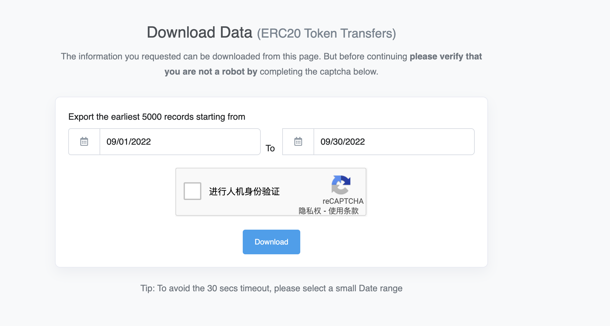

## 区块数据分析的调研结果

对于研究的设想，是通过分析地址上的 magic 代币在一段时间内的分布，来确定以月/年为单位的收支情况，因此我们需要的数据源是某个地址的 FILTERED BY TOKEN HOLDER(magic)，在这些数据中，通过每一个不同游戏的合约进行筛选和重新组合，来最终确定某个游戏，以月/年为单位的收支情况。

**由于 opensea 已经上线 arbitrum 暂时忽略，仅研究以 magic 计价的游戏**

因此重要的工作在于可以下载正确的区块数据，并重新筛选组合，第一个研究的方向就是如何下载某个地址的区块数据。

**先确定结论**

自己下载区块数据，然后导入到数据清洗脚本中做一次清洗，筛选和组合过后存入数据库中，账本应用将使用数据库中的数据进行分类展示。

### 全节点

这一项工作其实对于商业化来说是必要过程，由自己来维护全节点，并且将区块数据实时的同步到文档节点中，自己维护区块数据。

### nansen

Alex Svanevik 创建了 [https://github.com/blockchain-etl/public-datasets](https://github.com/blockchain-etl/public-datasets) 这是对区块数据进行 ETL 的工具。

> ETL (extract transform load) 是将多个系统中的数据组合到单个数据库，数据存储空间，数据仓库的传统方法。

> Alex Svanevik 是 [https://www.nansen.ai/](https://www.nansen.ai/) 的 CTO

上述的数据集都放置在 BigQuery 中，并对所有人开放，所有人都可以通过 BigQuery 来访问，解析区块链上的数据。

### etherscan

[https://etherscan.io/](https://etherscan.io/) 提供对常规区块数据的 APIs 服务，并且有收费定制版本

> [https://docs.etherscan.io/](https://docs.etherscan.io/)

由于我们的研究是在 arbitrum 上，[https://arbiscan.io/](https://arbiscan.io/) 提供的数据 APIs 受到限制

### dune

https://dune.com/ 也是一家提供数据查询的服务提供商，他们将区块数据重新整合，写入了数据库，并提供 SQL 查询。

