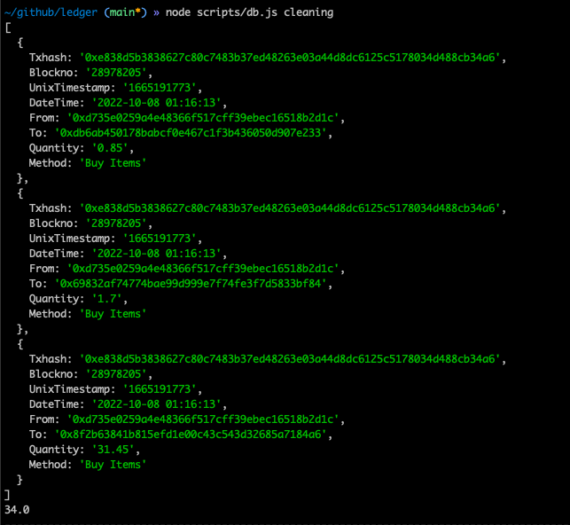

## 区块数据分析的调研结果

对于研究的设想，是通过分析地址上的 magic 代币在一段时间内的分布，来确定以月/年为单位的收支情况，因此我们需要的数据源是某个地址的 FILTERED BY TOKEN HOLDER(magic)，在这些数据中，通过每一个不同游戏的合约进行筛选和重新组合，来最终确定某个游戏，以月/年为单位的收支情况。

**由于 opensea 已经上线 arbitrum 暂时忽略，仅研究以 magic 计价的游戏**

因此重要的工作在于可以下载正确的区块数据，并重新筛选组合，第一个研究的方向就是如何下载某个地址的区块数据。

**先确定结论**

自己下载区块数据，然后导入到数据清洗脚本中做一次清洗，筛选，重组后存入数据库中，账本应用将使用数据库中的数据进行分类展示。

### 全节点

这一项工作其实对于商业化来说是必要过程，由自己来维护全节点，并且将区块数据实时的同步到文档节点中，自己维护区块数据。

### nansen

Alex Svanevik 创建了 [https://github.com/blockchain-etl/public-datasets](https://github.com/blockchain-etl/public-datasets) 这是对区块数据进行 ETL 的工具。

> ETL (extract transform load) 是将多个系统中的数据组合到单个数据库，数据存储空间，数据仓库的传统方法。

> Alex Svanevik 是 [https://www.nansen.ai/](https://www.nansen.ai/) 的 CTO

上述的数据集都放置在 BigQuery 中，并对所有人开放，所有人都可以通过 BigQuery 来访问，解析区块链上的数据。

### etherscan

[https://etherscan.io/](https://etherscan.io/) 提供对常规区块数据的 APIs 服务，并且有收费定制版本

> [https://docs.etherscan.io/](https://docs.etherscan.io/)

由于我们的研究是在 arbitrum 上，[https://arbiscan.io/](https://arbiscan.io/) 提供的数据 APIs 受到限制

### dune

https://dune.com/ 也是一家提供数据查询的服务提供商，他们将区块数据重新整合，写入了数据库，并提供 SQL 查询，对于 arbitrum 的 APIs 支持没有。

## 清洗数据的方法

如果是常规的去遍历区块，在这里只能知道这是一种购买行为，且无法知道 Tokens Transferred 内部交易的细节，`debug_traceTransaction` 如 Alchemy 端点只提供在 Rinkeby Goerli 测试网中。

[https://dashboard.alchemy.com/enhanced-apis#debug-api](https://dashboard.alchemy.com/enhanced-apis#debug-api)

从 `arbiscan` 上导出的格式如下：

"Txhash","Blockno","UnixTimestamp","DateTime","From","To","Quantity","Method"

这里 `arbiscan` 将内部交易也转换成了数据，但是只能知道购买行为，但是无法知道买了什么，更不知道属于什么游戏，如果用这一份数据，只能简单的进行 magic 代币的数据加减法。

造假数据后存入 LEANCLOUD

**补充说明**

以 `elleria` 游戏为例，现有的 arbiscan 上下载的数据无法进行清洗，缺少了一些关键数据进行逻辑判断。

#### 增量账户如何判断：
需要监听所有合约的增量event，若存在event log中EOA地址不在存量db中，该地址为新增用户，需要插入该用户地址的记录到db中。

#### 增量数据获取逻辑：
获取db中最大的区块高度，若没有则认为是0，检索链上event时只需要从该区块高度开始（为0时传入fromBlock参数为字符串earliest）

## 二、流程
#### 1. 初始化
* 初始化provider：通过url初始化arb链的provider对象
* 初始化检索条件
	+ from_height：从db中获取最近的区块高度
	* 交易合约地址：
		ELM swap：0xf904469497e6a179a9d47a7b468e4be42ec56e65
		nft swap: 0x09986b4e255b3c548041a30a2ee312fe176731c2
		magic transfer: 0x84c8bd99df40626f6d9cb9a1e71d2f65278d75fa (World Boss收益)
	* NFT token：
		0x7480224ec2b98f28cee3740c80940a2f489bf352 英雄/角色
		0x381227255ef6c5d85966b78d13e4b4a4c8719b5e 遗物
#### 2. 开启三个线程，并发获取链上数据
* 线程1：获取ELM swap的event log，获取该event log对应的block（获取时间戳），获取该event log对应的transaction（获取input data）
* 线程2：获取nft swap的event log，获取时间戳与input data同上
* 线程3：获取magic transfer的transaction，获取时间戳与input data同上
	以上都需要解析对应transaction的input data，以此来获取是否支出还是收入，以及对应金额。
#### 3. 在线程中，对链上数据进行清洗，然后存入leancloud db中
* 格式化数据后，将数据存入db中